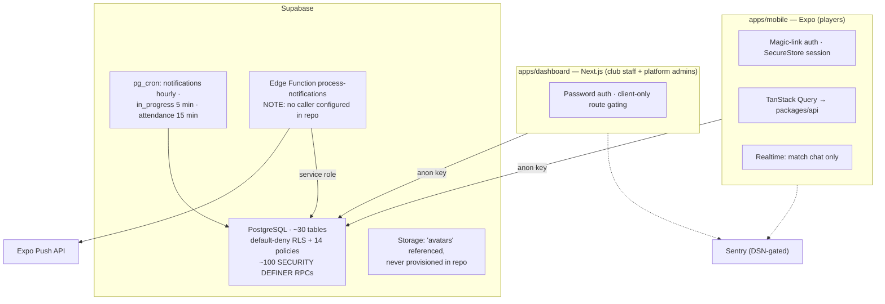

# Tennis Lebanon — Technical, Security & Product Audit

**Date:** 28 July 2026
**Branch audited:** `milestone-8-pilot-hardening` (commit `3498bb6`, plus uncommitted M8.5/M8.6 work)
**Scope:** Full-repository static audit — architecture, security, database & concurrency, business logic, reliability, and product effectiveness
**Method:** Read-only static analysis of all source, all 29 migrations, and CI configuration, plus non-mutating verification commands (`lint`, `typecheck`, `test`, `db:validate`, `format:check`, `verify:pilot`, `pnpm audit`). No files were modified, no database was written to, and no staging or production service was contacted.

**Limits of this audit:** Race conditions cannot be _proven_ without runtime concurrency tests; locking logic was verified by reading. No claim is made about production Supabase dashboard settings, EAS, or Vercel configuration, since these are not evidenced in the repository.

---

## 1. Executive summary

- **The foundation is genuinely strong.** The database security model — the hardest thing to retrofit later — is better than most funded startups ship. The biggest stated fear (wrong permissions) is largely handled.
- **Club staff cannot see other clubs' bookings.** Every booking function was traced; no cross-club leak exists. _Founder priority #2 passes._
- **Player phone numbers are never exposed** — they are not even stored in the schema. Players see coarse zones only, never addresses. _Founder priority #3 passes._
- **Arabic text is complete; Arabic _layout_ is not.** Translations are finished and guarded by tests, but the app never activates right-to-left layout mirroring, so Arabic renders inside a left-to-right layout on roughly 41 of 43 screens. _Founder priority #4 does not pass today._
- **The CI safety net is effectively switched off.** A code-formatting step fails first, causing every later check — lint, types, tests, migration validation — to be skipped. All of those pass when run manually, so this is a one-command fix with an outsized payoff.
- **Any signed-up user can create a fake tennis club** visible to all players, then point its "book a court" action at a phone number they control. This was a deliberate "add review later" decision; later is now.
- **A cancelled match can return to life** as `confirmed` through a specific club-alternative sequence, and can strand a booking in the club's queue that nobody is able to clear.
- **The most likely way matches die is voting deadlock.** All participants must agree on one time slot, and only the host may propose times. One unresponsive host, or one player whose availability doesn't match, kills the match silently.
- **Moderators can review reports but cannot act on them.** There is no way to suspend a user without a developer editing the database directly — which the operations guide explicitly promises will not be necessary.
- **Recommendation: ready for a controlled pilot after a defined fix list** — roughly one to two weeks of focused work, most items small.

---

## 2. Architecture map



### How authorization works

Authorization lives **entirely in PostgreSQL**. Both applications hold only the publishable anon key. Every privileged operation runs through a `SECURITY DEFINER` function that re-checks the caller via one of:

| Gate                                                                 | Enforces                                                     |
| -------------------------------------------------------------------- | ------------------------------------------------------------ |
| `assert_discovery_caller_eligible()` / `assert_marketplace_caller()` | authenticated + active account + onboarded + adult-confirmed |
| `assert_club_staff(club_id)` / `assert_club_admin(club_id)`          | active membership of that specific club                      |
| `assert_platform_operator()`                                         | `platform_roles` support/admin                               |
| `assert_accepted_match_participant(match_id)`                        | accepted participant of that match                           |

All ~30 tables have RLS enabled with default deny. Only 14 narrow policies exist (own-row CRUD, public reads of active zones/clubs/courts, and one participant-scoped policy on `match_messages` needed for Realtime). Table privileges are revoked from `authenticated` and re-granted column by column.

### Stack summary

pnpm 10 + Turborepo monorepo; Node 20; TypeScript 6 with `strict: true` and `noUncheckedIndexedAccess`. Apps: `mobile` (Expo Router), `dashboard` (Next.js 16 App Router, fully client-rendered). Packages: `api` (typed RPC wrappers), `domain` (Zod schemas + pure rules), `config` (env validation), `i18n` (en/ar/fr), `types` (generated), `ui` (tokens).

---

## 3. Top ten risks by urgency

| #   | Risk                                                    | ID      | Why it matters now                             |
| --- | ------------------------------------------------------- | ------- | ---------------------------------------------- |
| 1   | CI runs no checks at all                                | REL-01  | No regression protection while fixes land      |
| 2   | Anyone can create a fake club + phishing booking link   | SEC-001 | Reaches pilot players directly                 |
| 3   | Arabic layout not mirrored                              | REL-02  | Stated priority #4; affects every Arabic user  |
| 4   | Cancelled match resurrects; booking stuck in club queue | DB-01   | Confuses partner clubs in workflow 3           |
| 5   | Voting deadlock kills matches silently                  | BL-01   | The core north-star workflow fails             |
| 6   | Blocked users can still meet via others' matches        | SEC-004 | Safety promise broken                          |
| 7   | Moderation has no enforcement action                    | BL-04   | Contradicts documented no-SQL operations       |
| 8   | Court operating hours never enforced                    | DB-02   | 3 a.m. bookings reach real clubs               |
| 9   | Language resets to English on every launch              | REL-03  | Arabic/French users re-select constantly       |
| 10  | Push delivery has no scheduler in the repo              | ARCH-02 | Reminders may never send in staging/production |

---

## 4. Full findings register

Severity: **Critical** = exploitable security, data loss, or core workflow broken for all users · **High** = likely privacy violation, wrong club access, or frequent match failure · **Medium** = reliability/UX affecting pilot success · **Low/Info** = tech debt, polish, doc drift.

_No Critical findings. Five High._

| ID      | Sev  | Conf      | Area          | Finding                                                              | Evidence                                                                   | Impact                                                | Fix                                                                        | Effort |
| ------- | ---- | --------- | ------------- | -------------------------------------------------------------------- | -------------------------------------------------------------------------- | ----------------------------------------------------- | -------------------------------------------------------------------------- | ------ |
| REL-01  | High | Confirmed | CI            | `format:check` fails first → lint/typecheck/test/db:validate skipped | `.github/workflows/ci.yml:38-51`; 51 genuinely unformatted committed files | No automated safety net                               | `pnpm format`, commit; move format check last                              | S      |
| SEC-001 | High | Confirmed | AuthZ         | Any user self-provisions an active club + club-admin role            | `016_club_admin.sql:67-202`, grant `:581`                                  | Fake clubs, WhatsApp phishing                         | Gate on `assert_platform_operator()` or `is_active=false` pending approval | S      |
| REL-02  | High | Confirmed | i18n/RTL      | `I18nManager.forceRTL` never called                                  | `apps/mobile/app/rtl-check.tsx:11-16`; 2 of 43 screens use direction hook  | Arabic inside LTR layout                              | Enable forceRTL + reload handling; verify flows                            | M      |
| DB-01   | High | Confirmed | State machine | Cancelled match → `confirmed`; stuck `alternative_proposed` booking  | `029:176-182`, `014:773-776`, `014:561-564`                                | Zombie matches; blocked court; un-clearable queue row | Add status guards; include `alternative_proposed` in cancel                | S      |
| BL-01   | High | Confirmed | Product       | Unanimous vote required; only host may propose times                 | `011:62-84`, `011:213-241`, `011:177-199`                                  | Silent match death (ghosting)                         | Let participants propose times; add host override                          | M      |
| SEC-004 | Med  | Confirmed | Safety        | Block checked only against match creator                             | `007_matches.sql:105-107`                                                  | Blocked user shares match + chat                      | Check block against all accepted participants                              | S      |
| DB-02   | Med  | Confirmed | Booking       | Court operating hours never validated                                | Only written/displayed; `docs/DATABASE.md:102` requires it                 | Out-of-hours bookings reach clubs                     | Validate range in request + both accept paths                              | S      |
| BL-04   | Med  | Confirmed | Operations    | No suspension RPC exists at all                                      | `account_status` only ever read across 29 migrations                       | Cannot action bad actors without SQL                  | Add `suspend_user_account` + audit event                                   | M      |
| BL-03   | Med  | Confirmed | Product       | One withdrawal cancels the whole doubles match                       | `029:355-361`                                                              | 3 players lose their court                            | Keep booking for doubles; seek replacement                                 | M      |
| BL-02   | Med  | Confirmed | Lifecycle     | `ready_to_book` never expires                                        | `018:85-87`                                                                | Permanent limbo matches                               | Extend expiry to `ready_to_book`                                           | S      |
| SEC-002 | Med  | Confirmed | AuthZ         | Club role checks ignore `account_status`                             | `016_club_admin.sql:3-21`, `014:42-57`                                     | Suspended staff keep club powers                      | Join `profiles` in `is_club_staff`/`is_club_admin`                         | S      |
| REL-03  | Med  | Confirmed | i18n          | Locale not persisted; resets to English each launch                  | `apps/mobile/src/lib/i18n.ts:9`; no storage writes                         | Arabic/French users re-select every time              | Persist choice + device-locale detection                                   | S      |
| REL-04  | Med  | Confirmed | Reliability   | No ErrorBoundary in either app                                       | grep: none found                                                           | One render error = white screen                       | Add boundaries at root and screen level                                    | S      |
| REL-05  | Med  | Confirmed | Testing       | Dashboard has zero tests                                             | `"test": "echo \"no unit tests yet\""`                                     | Club/admin UI entirely unverified                     | Add tests for booking queue + admin gating                                 | M      |
| REL-06  | Med  | Confirmed | Testing       | 1 of 5 required e2e flows exists                                     | only `e2e/maestro/m1-auth-onboarding.yaml`                                 | Regressions undetected                                | Add flows 2–5                                                              | M      |
| SEC-003 | Low  | Confirmed | Privacy       | `is_platform_operator(uuid)` accepts arbitrary user id               | `026:3-16`, grant `:182`                                                   | Admin account enumeration                             | Drop parameter on client-callable form                                     | S      |
| SEC-005 | Low  | Confirmed | AuthZ         | Dashboard admin routes gated only in client                          | `apps/dashboard/src/app/admin/reports/page.tsx:17-40`                      | UI-layer only; RPCs safe                              | Optional Next.js middleware                                                | M      |
| DB-03   | Low  | High      | UX            | Court-overlap violation surfaces as raw Postgres error               | `014:544-552`                                                              | Confusing error for club staff                        | Catch `exclusion_violation`, raise friendly code                           | S      |
| DB-04   | Low  | Confirmed | Config        | Client hard-codes 24h late-cancel window                             | `packages/domain/src/cancellation-policy.ts:1` vs `029:15-30`              | Wrong warning if policy tuned                         | Read window from RPC                                                       | S      |
| REL-08  | Low  | Confirmed | Database      | `platform_policy_settings` created without RLS                       | `db:validate` warning; `029:3-13`                                          | Mitigated (grants revoked)                            | Enable RLS; make validator warnings fail CI                                | S      |
| REL-09  | Low  | Confirmed | Rate limit    | Invitation limit (20/user/day) specified, not implemented            | `docs/TESTING_SECURITY.md:71`                                              | Invite spam possible                                  | Add counter in `create_match_invite`                                       | S      |
| REL-10  | Low  | Confirmed | CI            | No dependency or secret scanning                                     | `docs/TESTING_SECURITY.md:77` requires it                                  | CVEs invisible to the team                            | Add `pnpm audit` + secret scan steps                                       | S      |
| SEC-008 | Low  | Confirmed | Dependencies  | 4 High / 2 Moderate CVEs, all unreachable                            | `pnpm audit`; no `next/image`, no user-supplied CSS                        | None at runtime                                       | Overrides for `uuid`, `brace-expansion`                                    | S      |
| SEC-006 | Low  | Confirmed | Invites       | Share links are bearer tokens, valid for private matches             | `021:325-341`, `010:38-64`                                                 | Forwarded link joins a private match                  | Accepted design; cap active invites                                        | S      |
| REL-07  | Low  | Confirmed | Realtime      | No reconnect or degraded-state handling in chat                      | `MatchChatPanel.tsx:37-58`                                                 | Silent stale chat after socket drop                   | Handle `.subscribe()` status; refetch on reconnect                         | S      |
| BL-05   | Low  | Confirmed | Product       | Doubles never rated — **intentional**                                | `023:192-194`; `docs/DATABASE.md:115`                                      | Doubles-only players permanently provisional          | Accept for v1; monitor                                                     | —      |
| SEC-007 | Info | Confirmed | Robustness    | `accept_match_invite` lacks `if not found` check                     | `010:210-217`                                                              | Fails safely, misleading error                        | Add explicit check                                                         | S      |
| DB-05   | Info | Confirmed | Database      | Participant capacity has no DB constraint                            | RPC logic only                                                             | Safe today (grants revoked)                           | Optional deferred trigger                                                  | S      |
| BL-06   | Info | Confirmed | Lifecycle     | `open → ready_to_book` can skip `full`                               | `011:92-93` vs `docs/LIFECYCLE.md:24`                                      | Harmless drift                                        | Align doc or code                                                          | S      |

### Intentional v1 deferrals (not counted against the build)

Doubles rating (`docs/DATABASE.md:115`), no auto-reject on club booking timeout (`docs/LIFECYCLE.md:98`), placeholder pilot geography, and self-service club onboarding _as a concept_ (`docs/DECISIONS.md:261`). Note that SEC-001 concerns the _ungated_ form of that last item, not the idea itself.

---

## 5. Security findings (detail)

### SEC-001 — Self-service club registration grants club-admin and publishes an active club

**Severity: High · Confidence: Confirmed · Fix layer: database · Effort: Small**

`register_pilot_club` (`016_club_admin.sql:67-202`) is granted to every authenticated user (`:581`). Its only gate is `if v_user_id is null then raise` — no onboarding check, no `account_status` check, no operator approval. It inserts `clubs (... is_active => true)` and `club_memberships (role 'admin')` for the caller.

**Attack scenario:** create an account → call `register_pilot_club` (via the `/onboarding` link shown to every dashboard user, or directly over the RPC endpoint) → a fake club appears in every player's directory, because `list_clubs_directory` and the `clubs_read_active` policy expose all active clubs → call `update_club_booking_settings` (`017:135`, also admin-of-own-club only) to set `booking_mode='external_link'` with an attacker-controlled number → players tapping "book" are handed that WhatsApp contact.

Because it checks only `auth.uid()`, it is reachable by an account that never completed onboarding and by a suspended account.

**Remediation:** gate on `assert_platform_operator()`, or insert clubs as `is_active = false` pending an operator approval RPC with an audit event. For 5–8 curated pilot clubs, operator provisioning is the right model; self-service is unnecessary scope.

**Tests required:** non-operator call raises `42501`; suspended user raises; club appears in the directory only after approval.

**Note:** `docs/DECISIONS.md:261` records this as intentional — _"new clubs are active immediately in local pilot (platform review can be added later)."_ It is flagged because "later" is now, before real players see the directory.

### SEC-002 — Club role checks ignore account status

**Severity: Medium · Confidence: Confirmed · Fix layer: database · Effort: Small**

`is_club_staff` (`014:42-57`) and `is_club_admin` (`016:3-21`) check `club_memberships.is_active` and role, but never `profiles.account_status`. A suspended user retaining an active membership row keeps full club powers — accepting/rejecting bookings, creating court blocks. Fix by joining `profiles` and requiring `account_status = 'active'`.

### SEC-003 — Platform-operator status is enumerable

**Severity: Low · Confidence: Confirmed · Fix layer: database · Effort: Small**

`is_platform_operator(p_user_id uuid default auth.uid())` (`026:3-16`) is `SECURITY DEFINER` and granted to all authenticated users (`:182`), accepting any UUID. Since user IDs appear in match-hub participant lists, an attacker can identify which accounts are platform admins — useful targeting for phishing. Expose a no-argument form to clients and keep the parameterised version internal.

### SEC-004 — Block only applies to the match creator

**Severity: Medium · Confidence: Confirmed · Fix layer: database · Effort: Small**

`is_blocked` is correctly bidirectional (`004:50-62`), but `assert_joinable_match` tests it only against `creator_id` (`007:105-107`). In doubles, if B blocked C and C is a participant in A's match, B can still join — landing in a shared match and chat (`019:116` scopes chat to participants with no block filter). Discovery filters only on creator too (`009:265`), so the match stays visible to B.

**Attack scenario:** a harasser blocked by their target rejoins that target's circle through any doubles match the target did not create. This directly undermines the safety promise behind blocking.

**Remediation:** reject in `assert_joinable_match` if the viewer is blocked against _any_ accepted participant; mirror the filter in `discover_open_matches`.

### SEC-005 — Dashboard admin routes gated only in the client

**Severity: Low · Confidence: Confirmed · Fix layer: frontend · Effort: Medium**

There is no middleware, server component, or route handler; gating is a `useEffect` plus `router.replace` (`admin/reports/page.tsx:17-40`). A non-operator can force the shell to render by disabling JavaScript. **Rated Low because the data is safe:** `list_open_user_reports` and `list_disputed_results` both call `assert_platform_operator()` server-side (`028:121`, `026:108`), so a forced render yields an empty, erroring page. This is UI-layer only, exactly as `CLAUDE.md` prescribes.

### SEC-006 — Invite share-links are bearer tokens

**Severity: Low (accepted design) · Confidence: Confirmed**

Link invites (`invited_user_id` null) pass `assert_joinable_match(..., p_allow_non_public => true)`, so anyone holding a forwarded link can join a `private` match. Mitigations are solid: 192-bit token via `gen_random_bytes(24)`, SHA-256 stored rather than raw, 14-day expiry, single use, revoked when the match fills. Residual: no rate limit on `create_match_invite`.

### SEC-007 — `accept_match_invite` proceeds on a not-found token

**Severity: Informational · Confidence: Confirmed**

Unlike `accept_match_invitation` (`010:239`), the token variant has no `if not found` check (`010:210-217`). With an all-NULL row the guard at `:55-59` evaluates to NULL rather than true and falls through, failing safely one step later in `assert_joinable_match`. Correct outcome, fragile mechanism, misleading error message.

### SEC-008 — Dependency vulnerabilities (all transitive, none reachable)

**Severity: Low · Confidence: Confirmed · Fix layer: infrastructure**

| Severity | Package           | Present | Needs   | Via                                       |
| -------- | ----------------- | ------- | ------- | ----------------------------------------- |
| High     | `sharp`           | 0.34.5  | ≥0.35.0 | `next`                                    |
| High     | `postcss`         | 8.4.31  | ≥8.5.12 | `next`                                    |
| High     | `postcss`         | 8.4.31  | ≥8.5.18 | `next`                                    |
| High     | `brace-expansion` | 1.1.16  | ≥5.0.8  | `eslint` → `minimatch`                    |
| Moderate | `postcss`         | 8.4.31  | ≥8.5.10 | `next`                                    |
| Moderate | `uuid`            | 7.0.3   | ≥11.1.1 | `expo` → `@expo/config-plugins` → `xcode` |

**Reachability:** `sharp` requires untrusted image processing — `next/image` is used nowhere and no `images` config exists, so it is never invoked. All three `postcss` advisories require attacker-controlled CSS — the dashboard uses inline style objects plus a single owned `globals.css`, processed only at build time. `brace-expansion` is dev-only (ESLint). `uuid` is Expo build tooling, not shipped.

**Complication:** Next.js is current (16.2.11) but pins `postcss@8.4.31` itself, so upgrading Next will not clear those three. Closing them requires `pnpm.overrides` (absent today) and a build test. Recommend overriding `uuid` and `brace-expansion` (safe), and either accepting `postcss`/`sharp` with the documented rationale above or overriding with a full dashboard build validation.

### Verified clean

These were specifically probed and hold up:

- **Club cross-tenant isolation.** Every booking mutation re-derives `club_id` from the court and calls `assert_club_staff` (`014:533-534`, and similarly in `reject_booking`, `propose_booking_alternative` — which additionally forces the alternative court to the same club at `:670`). Reads are scoped by both `assert_club_staff(p_club_id)` _and_ `where ct.club_id = p_club_id` (`015:66, 92`). Court, hours, and block RPCs all derive club from the court or block id (`016:447-457, 508-518, 554-564`). No IDOR found.
- **Phone numbers.** `club_private_contacts` is revoked from `authenticated` with no policy (`003:35`); the player-facing `get_club_detail` exposes only a `whatsapp_booking_available` boolean (`017:207-210`). Digits come only from the deliberate share action and are a club business line. No player phone exists in the schema at all.
- **Private/invite-only confidentiality.** `get_match_hub` admits non-participants only for `public` matches in `open`/`full`/`ready_to_book` (`023:387-393`); discovery filters `visibility = 'public'` (`009:264`).
- **Chat.** Participant-scoped in both the RPC and the RLS policy backing Realtime; SELECT-only grant, writes solely via `send_match_message` with a 60-message/hour limit (`019:102`).
- **Result integrity.** Submitter cannot confirm or dispute their own result (`023:278, 331`); one result per match; `apply_rating_for_result` is service-role only and idempotent.
- **Secrets.** `.env` and `apps/dashboard/.env.local` are gitignored and **have never been committed** (verified via `git log --all`). Only placeholder `.env.example` is tracked. No service-role key reaches client code. CI uses placeholder keys only.
- **PII in logs.** **Zero** `console.*` calls in `apps/`. Push payloads are deliberately generic ("Open the app to view and respond") with no names, scores, or times (`021:351-355`). Sentry sets `sendDefaultPii: false`.
- **Injection.** No dynamic SQL anywhere; every function pins `set search_path = ''` and schema-qualifies. The one `ilike` search binds a parameter rather than concatenating.
- **Mass assignment.** `profiles` allows `update (avatar_path)` only; `player_profiles` is restricted to preference columns with `skill_band` explicitly revoked (`003:3`). Rating and consent fields are unreachable from clients.
- **Deep links.** `parseAuthUrl` uses a strict scheme + host + path allowlist and never logs tokens (`auth-url.ts:6-19`); sessions are held in SecureStore.

---

## 6. Database and concurrency findings

### The ten race scenarios

| #   | Scenario                            | Verdict                       | Mechanism                                                                                                            |
| --- | ----------------------------------- | ----------------------------- | -------------------------------------------------------------------------------------------------------------------- |
| 1   | Two users take the final slot       | **Protected**                 | `assert_joinable_match` holds `select … for update` on the match row (`007:87-91`); capacity checked inside the lock |
| 2   | Same user joins twice               | **Protected ×2**              | PK `(match_id, user_id)` + explicit `already_participant` check                                                      |
| 3   | >2 singles / >4 doubles             | **Protected (RPC only)**      | All three join paths check capacity under the row lock; no DB constraint (DB-05)                                     |
| 4   | Two approvals, same court/time      | **Protected (DB constraint)** | GiST exclusion `no_overlapping_accepted_court_bookings` (`001:277-282`)                                              |
| 5   | Cancel during booking approval      | **VULNERABLE**                | DB-01                                                                                                                |
| 6   | Duplicate / conflicting results     | **Protected ×2**              | `match_results.match_id` UNIQUE + existence check under lock                                                         |
| 7   | Unauthorized rating update          | **Protected**                 | Service-role only; idempotent; `internal_rating` not client-writable                                                 |
| 8   | Duplicate requests on retry         | **Protected**                 | `deduplication_key` unique; push-token upsert; one-active-booking-per-match partial unique index                     |
| 9   | Deleted/banned user in active match | **GAP**                       | BL-04 — no suspension mechanism exists                                                                               |
| 10  | Club staff removed mid-action       | **Protected**                 | `is_club_staff` re-reads membership per call, no JWT caching                                                         |

Scenarios 1–3 rely on `FOR UPDATE` serialization that can be verified by reading but not proven without concurrency tests. The locking is correct as written; the concurrent-join test called for by `docs/LIFECYCLE.md:141` should still be run before pilot.

### DB-01 — Cancelled match resurrects to `confirmed`

**Severity: High · Confidence: Confirmed · Fix layer: database · Effort: Small**

Two independent gaps compound:

1. `cancel_match` looks for bookings `where b.status in ('requested','accepted')` (`029:176-182`) — **`alternative_proposed` is missing**, so that booking survives the cancellation.
2. Both `accept_booking` (`014:561-564`) and `respond_booking_alternative` (`014:773-776`) set the match to `confirmed` with **no status guard**:
   ```sql
   update public.matches set status = 'confirmed', updated_at = now()
   where id = v_booking.match_id;
   ```
   Every _reverse_ transition is guarded (`and status = 'booking_pending'` in `reject_booking` `:616`, `cancel_booking_request` `:503`, and the decline branch `:796`). The asymmetry shows this is an oversight.

**Failure path:** match is `booking_pending` → club proposes an alternative → creator cancels the match (permitted) → match is `cancelled` but the booking is untouched → creator calls `respond_booking_alternative(id, true)` → booking `accepted`, **match flips back to `confirmed`**. Participants told the match was cancelled now hold a confirmed booking, and the GiST constraint blocks that court/time for a zombie match.

**Second failure, no attacker needed:** once a booking is `alternative_proposed`, only the requester can act on it — `accept_booking` and `reject_booking` both require status `requested`. If the requester never responds, the booking sits in the club's queue permanently with **no club-side exit**, and occupies the one-active-booking slot so the match can never request another court.

**Remediation:** add `alternative_proposed` to the `cancel_match` lookup; add `and status = 'booking_pending'` to both `confirmed` transitions; add a club-side or scheduled expiry for stale alternatives.

### DB-02 — Court operating hours never validated

**Severity: Medium · Confidence: Confirmed · Fix layer: database · Effort: Small**

`court_operating_hours` is written by club-admin RPCs and read only for display (`016:255`, `017:84`). A grep across all migrations shows **zero** validation reads. All four booking paths check `court_has_block` only.

This contradicts `docs/DATABASE.md:102`, which requires validation against `court_blocks` **and** `court_operating_hours`. A match agreeing on 03:00 produces a request nothing rejects; if staff tap accept, the booking is recorded. Clubs configure hours in the dashboard and will reasonably assume they are enforced.

### DB-03 — Overlap collisions surface as raw Postgres errors

**Severity: Low · Confidence: High**

`accept_booking` re-checks `court_has_block` but not overlap; the exclusion constraint fires as SQLSTATE `23P01`, uncaught (`014:544-552`). Two staff accepting overlapping requests means the second sees an unhandled database error rather than "that court is already booked."

### DB-04 — Client hard-codes the late-cancel window

**Severity: Low · Confidence: Confirmed**

`LATE_CANCEL_HOURS = 24` in `packages/domain/src/cancellation-policy.ts:1` versus `late_cancel_window_hours()` reading `platform_policy_settings` (`029:15-30`). The database is authoritative for actual classification (correct), but the client's warning copy uses a compile-time constant — so tuning the policy during the pilot, which is the entire point of making it configurable, warns users against the wrong threshold.

### Schema, timezone, and idempotency notes

**Timezone handling is correct.** All timestamps are `timestamptz`; `Asia/Beirut` appears only in `zones.timezone`, availability windows, and display helpers. WhatsApp messages explicitly label times "(UTC)" (`017:344`) — safe, though Beirut local time would be friendlier. Interval arithmetic on `timestamptz` gives correct absolute-time semantics across Lebanon's DST shifts. No DST bug found.

**The notification outbox is the best-engineered subsystem in the repository:** `deduplication_key` unique with `on conflict do nothing`, `for update skip locked` batch claiming, and an `attempt_count < 3` retry cap (`021:82-99`). All four scheduled jobs are wired into the current `run_notification_jobs` (`024:66-69`).

**Audit coverage** is good on bookings (`booking_events` on every transition) and admin actions, thinner on match lifecycle — `cancel_match` writes an audit event only when a reason was supplied (`029:237`), so free cancellations from `draft`/`open` leave no trail.

### Rules enforced only in the UI

Genuinely short, which credits the design — every domain helper checked (`canShowJoinAction`, `canVoteOnTimes`, `canManageProposedTimes`, `canCreatorCancelMatch`, `findActiveHostedMatch`) has a matching server-side assertion. The real client-only items are:

1. Late-cancel window (DB-04).
2. Court operating hours (DB-02).
3. Zone active-state on match creation — `create_match_draft` (`013:41-43`) relies on the FK for existence but never checks `zones.is_active`, unlike `complete_onboarding` (`002:167-177`). A match could target a deactivated zone and become undiscoverable.

---

## 7. Business logic — state machines

### Match status map (as implemented)

| Status                  | Entered by                                       | From                                      | Side effects                                  | Exits                                                        |
| ----------------------- | ------------------------------------------------ | ----------------------------------------- | --------------------------------------------- | ------------------------------------------------------------ |
| `draft`                 | `create_match_draft`                             | —                                         | creator auto-accepted; times + zones inserted | `open`, `cancelled`                                          |
| `open`                  | `publish_match`                                  | `draft`, `full`, `ready_to_book`          | discovery-visible                             | `full`, `ready_to_book`, `cancelled`, `expired`              |
| `full`                  | `refresh_match_open_state`                       | `open`, `ready_to_book`                   | leaves discovery                              | `open`, `ready_to_book`, `cancelled`, `expired`              |
| `ready_to_book`         | `refresh_match_time_agreement`                   | `open`, `full`                            | sets `selected_time_option_id`                | `full`, `booking_pending`, `cancelled` — **never `expired`** |
| `booking_pending`       | `request_match_booking`                          | `ready_to_book`                           | booking row + audit; club nudged at 4h        | `ready_to_book`, `confirmed`, `cancelled`                    |
| `confirmed`             | `accept_booking` / `respond_booking_alternative` | `booking_pending` — **unguarded (DB-01)** | court locked by GiST                          | `in_progress`, `cancelled`                                   |
| `in_progress`           | `start_in_progress_matches` (cron, 5 min)        | `confirmed`                               | attendance prompts at 15 min                  | `completed`                                                  |
| `completed`             | `confirm_match_result` / `dispute_match_result`  | `in_progress`                             | rating applied on confirm                     | terminal                                                     |
| `cancelled` / `expired` | `cancel_match` / `expire_stale_matches`          | various                                   | invitations revoked                           | terminal — except DB-01                                      |
| `disputed`              | **never set by any code path**                   | —                                         | —                                             | —                                                            |

Correctly implemented: a disputed _result_ leaves the match `completed` with `result_status='disputed'`, exactly as `docs/LIFECYCLE.md:15` specifies. `match_status.disputed` is reserved for platform action and no such RPC exists yet — consistent with the doc.

### BL-01 — Unanimous-vote deadlock with creator-only time control

**Severity: High (product) · Confidence: Confirmed · Fix layer: database + frontend · Effort: Medium**

`refresh_match_time_agreement` requires `count(accepted participants) = count(yes votes)` on a single option (`011:62-84`) — strict unanimity. There is no majority rule, no creator override, and **no RPC anywhere that sets `selected_time_option_id` directly**. Meanwhile only the creator can add or withdraw time options (`011:213-241`, `011:177-199`), capped at 3 active.

**Failure scenario:** a doubles match fills with four players. None of the three proposed slots works for player D. D cannot propose an alternative. If the creator is unresponsive — the common case — the match sits at `full` until it expires seven days later. Nobody did anything wrong and the match dies silently. This is the "dead-end UX causing ghosting" fear expressed structurally.

**Remediation:** allow any accepted participant to propose a time option (keeping the 3-option cap), and/or give the creator an explicit "lock this time" RPC. The former is the smaller change and directly unblocks the deadlock.

### BL-02 — `ready_to_book` never expires

**Severity: Medium · Confidence: Confirmed · Effort: Small**

`match_should_expire` returns false unless status is `open`/`full` (`018:85-87`). A match that achieves unanimous agreement but whose creator never submits a booking request stays `ready_to_book` **forever** — the agreed time passes, the match still appears in `list_my_matches` with a stale "book a court" action, and no job cleans it up. The code faithfully implements `docs/LIFECYCLE.md:39`; the gap is in the doc as much as the code.

### BL-03 — One withdrawal cancels the entire doubles match

**Severity: Medium (product) · Confidence: Confirmed · Effort: Medium**

`withdraw_from_booked_match` unconditionally sets the match to `cancelled` and cancels the accepted booking (`029:355-361`). In doubles, one of four players withdrawing destroys the match and releases the court for the other three. `docs/LIFECYCLE.md:87` specifies only "requires reason… record attendance enum" — it never says cancel the match, and `:90` says the opposite for leaves. Implementation exceeds documented policy.

**Remediation:** for doubles, drop the withdrawer to `left`, record attendance, notify participants, and keep the booking — reverting to a "needs a replacement player" state. Singles legitimately has no match left, so cancelling is correct there.

### BL-04 — Moderation has no enforcement action

**Severity: Medium · Confidence: Confirmed · Effort: Medium**

Grepping `account_status` across all 29 migrations shows it is only ever **read**. `resolve_user_report` (`028:147-223`) sets report status and writes an audit event — that is all. **No `suspend_account` RPC exists.** `account_status='suspended'` is reachable only by direct SQL. `docs/DATABASE.md:106` further promises suspension "cancels their own pending unaccepted booking requests" — not implemented.

The mobile app already renders a `suspended` state (`auth-routing.ts:15-17`) that the backend can never produce. `docs/PILOT_OPERATIONS.md:65` promises "Platform operations (no SQL required)" and `docs/TESTING_SECURITY.md:115` gates release on the operator resolving disputes "without direct database editing" — dispute resolution does meet that bar; enforcement does not exist.

### BL-05 — Doubles never rated (intentional)

Documented at `docs/DATABASE.md:115, 118` and correctly implemented (`023:192-194`). **Consequence worth tracking:** `rated_match_count` never increments for doubles, and the provisional threshold is five confirmed results (`025:154`). A doubles-only player is permanently "provisional" with `display_rating = null`, and their `internal_rating` stays at the 1200 default — which is what discovery sorts and filters on. In a 300-player pilot with meaningful doubles play, match quality degrades for those users.

---

## 8. Reliability, i18n and CI findings

### REL-01 — The CI quality gate never runs

**Severity: High · Confidence: Confirmed · Fix layer: infrastructure · Effort: Small**

`.github/workflows/ci.yml:38-51` orders the quality steps: Format check → Lint → Typecheck → Unit tests → Migration checks. GitHub Actions skips subsequent steps in a job once one fails.

`pnpm format:check` **fails on committed code**. Verified precisely: 72 files differ from Prettier; 19 are a Windows CRLF artifact (`core.autocrlf=true`, no `.gitattributes`), but **51 are LF in the working tree and genuinely unformatted**, and nearly all are committed rather than from this branch's uncommitted work.

Consequence: lint, typecheck, unit tests, and migration validation have **never executed in CI**. All four pass when run manually, so the fix is `pnpm format` plus a commit — and ideally moving the format check last or marking later steps `if: always()`.

This also fails the pilot exit gate: `pnpm verify:pilot` exits 1 on this step alone.

### REL-02 — Arabic layout is never mirrored

**Severity: High · Confidence: Confirmed · Fix layer: frontend · Effort: Medium**

**`I18nManager.forceRTL` is never called.** The only mention in the codebase is a comment in `apps/mobile/app/rtl-check.tsx:11-16` stating that it deliberately does _not_ call it, describing native RTL mirroring as "a follow-up item, not required for M0."

Consequently, when a user selects Arabic:

- i18next switches strings to Arabic — this works.
- `I18nManager.isRTL` stays `false`, so flexbox `row` does not flip to `row-reverse`, `start`/`end` props do not flip, and default text alignment stays LTR.
- The only RTL adaptation is the manual `useLayoutDirection` hook, applied in **2 of 43 screens** (match hub and invite) plus a few components and the demo screen.

So Arabic script renders correctly _within_ a text run, but the surrounding layout — row order, alignment, chevrons, icon placement — remains left-to-right across the critical flows. This contradicts founder priority #4 and `docs/TESTING_SECURITY.md:100` ("Arabic RTL layout test on every critical flow").

**Encouraging detail:** only three physical direction style properties exist in the whole mobile app (one real: `paddingRight` in `LevelRangePicker.tsx:96`). Styles are otherwise direction-neutral, using `gap` and symmetric padding — so enabling `forceRTL` would likely flip most layouts correctly with modest cleanup. The groundwork is there; the switch was never thrown.

### REL-03 — Locale selection is not persisted

**Severity: Medium · Confidence: Confirmed · Effort: Small**

`apps/mobile/src/lib/i18n.ts:9` always initialises `lng: DEFAULT_LOCALE` ("en"), and the settings screen only calls `i18n.changeLanguage(locale)` with no storage write and no device-locale detection. An Arabic- or French-preferring user must re-select their language on **every app launch**.

### REL-04 — No error boundaries

**Severity: Medium · Confidence: Confirmed · Effort: Small**

Neither app defines an `ErrorBoundary` or `componentDidCatch`. A render error in any screen takes down the whole app — a redbox in development, a white screen in production — with no recovery path and no Sentry component context.

### REL-05 / REL-06 — Test coverage gaps

The dashboard's test script is literally `echo "no unit tests yet" && exit 0` — the entire club-staff and platform-admin UI is untested. Only one of the five end-to-end smoke flows required by `docs/TESTING_SECURITY.md:39-45` exists (`e2e/maestro/m1-auth-onboarding.yaml`).

### REL-07 — Realtime chat has no reconnect handling

`MatchChatPanel.tsx:37-58` calls `.subscribe()` with no status callback. If the socket drops or times out, there is no retry, no refetch, and no degraded-state indicator — users see stale chat until they navigate away.

### REL-08 — `platform_policy_settings` created without RLS

`pnpm db:validate` emits: _"029_cancellation_policy.sql: contains CREATE TABLE with no 'enable row level security' in the same file."_ Mitigated because all grants are revoked from `public, anon, authenticated` (`029:13`), so the Data API cannot reach it — but it violates `CLAUDE.md` and `docs/DATABASE.md:123` ("Every new table starts with RLS enabled"). Notably the validator **warns and still exits 0**, so CI would not catch this class of issue even once REL-01 is fixed.

### REL-09 / REL-10 — Specified controls not implemented

`docs/TESTING_SECURITY.md:71` specifies 20 invitations per user per day — not implemented (chat 60/hour, reports 1/day/target, and discovery 30/minute all _are_). `:77` requires dependency and secret scanning in CI — neither exists.

---

## 9. Product and workflow results

| #   | Workflow              | Verdict                                                                                                                                     |
| --- | --------------------- | ------------------------------------------------------------------------------------------------------------------------------------------- |
| 1   | **Join public match** | **Passes.** Join/approve, voting, and hub next-action all correct. Risk: BL-01 deadlock if slots don't align.                               |
| 2   | **Create and book**   | **Passes** end to end. Risk: DB-02 out-of-hours bookings; DB-01 if the club proposes an alternative.                                        |
| 3   | **Club queue**        | **Passes** with correct scoping and audit events. Bugs: DB-01 leaves un-clearable `alternative_proposed` rows; DB-03 raw errors on overlap. |
| 4   | **Result and rating** | **Passes** for singles. Doubles records results but never rates (intentional). Idempotency is solid.                                        |
| 5   | **Safety escalation** | **Passes as specified** — report appears, dismiss/resolve is audited, no SQL needed. But no enforcement action exists (BL-04).              |

### Friction and abandonment points

1. **Voting deadlock (BL-01)** — the single largest cause of matches that exist in the database but never get played.
2. **`ready_to_book` limbo (BL-02)** — a match with an agreed time that never gets booked has no exit and no nudge.
3. **Club silence** — after 4h and 24h, notifications fire, but there is no auto-reject and no easy "try another club" path from the hub. Intentional per `docs/LIFECYCLE.md:98`, worth watching in the pilot.
4. **Doubles fragility (BL-03)** — one withdrawal destroys three other players' plans.
5. **Language friction (REL-03)** — re-selecting Arabic on every launch.

### Overbuilt for a 300-player pilot

Draft-then-publish match creation, listing extension mechanics, and the dispute-resolution queue are all more machinery than 300 players and 5–8 clubs strictly need. None of it is harmful and all of it is built — no action recommended, just noting where complexity accumulated.

### Missing for the pilot

An enforcement action for moderation (BL-04) is the one genuine gap. Everything else in the MVP list from `CLAUDE.md` is implemented.

---

## 10. Testing gaps and verification results

Commands run on 28 July 2026 (all read-only):

| Command             | Result                                                           |
| ------------------- | ---------------------------------------------------------------- |
| `pnpm typecheck`    | **PASS** — 8/8 tasks                                             |
| `pnpm lint`         | **PASS** — 0 errors, 4 warnings                                  |
| `pnpm test`         | **PASS** — 26 vitest + 2 jest (mobile); dashboard has none       |
| `pnpm db:validate`  | **PASS** with 1 warning (REL-08)                                 |
| `pnpm format:check` | **FAIL** — 72 files (51 genuine)                                 |
| `pnpm verify:pilot` | **FAIL (exit 1)** — fails only on Prettier; all other gates pass |
| `pnpm audit`        | 4 High, 2 Moderate — all transitive, none reachable              |

Missing versus `docs/TESTING_SECURITY.md`: dashboard unit tests (zero); 4 of 5 e2e smoke flows; concurrency/race tests (§31) — none exist for the final-spot or booking races; suspended-user identity in the RLS matrix (§29) — untestable while suspension is unreachable; automated RTL layout checks (§100) — currently a manual visual screen; dependency and secret scanning in CI (§77).

The 24 pgTAP database test files are a real strength and cover authorization well.

---

## 11. Recommended monitoring and logging

Sentry is wired into both apps with `sendDefaultPii: false`, but is DSN-gated and unset in `.env.example` — **configure a real DSN before the pilot**, or crash reporting silently does nothing.

Add alerting on:

- `notifications` rows where `attempt_count >= 3` — silent push-delivery failure.
- Time since the Edge Function last ran (ARCH-02) — if nothing invokes it, all reminders stop with no error anywhere.
- Count of matches sitting in `ready_to_book` or `booking_pending` beyond 24 hours — the earliest ghosting signal.
- Club response time on booking requests — your key partner-club health metric.
- Weekly count of matches reaching `completed` — the north-star metric.

Keep the existing discipline of never logging message bodies, phone numbers, or tokens.

---

## 12. Immediate actions before pilot launch (ordered)

1. Run `pnpm format` and commit — unblocks the entire CI pipeline (REL-01).
2. Reorder CI so the format check cannot mask lint/type/test failures.
3. Gate `register_pilot_club` behind platform-operator approval (SEC-001).
4. Add status guards on both `→ confirmed` transitions and include `alternative_proposed` in `cancel_match` (DB-01).
5. Enable `I18nManager.forceRTL` and walk the critical flows in Arabic (REL-02).
6. Persist locale selection and detect device language (REL-03).
7. Extend the block check to all accepted participants (SEC-004).
8. Add `account_status` to `is_club_staff` / `is_club_admin` (SEC-002).
9. Validate court operating hours on booking request and accept (DB-02).
10. Allow any accepted participant to propose time options (BL-01).
11. Add a `suspend_user_account` RPC with an audit event (BL-04).
12. Add error boundaries to both application roots (REL-04).
13. Configure the Edge Function scheduler and verify a push notification actually arrives (ARCH-02).
14. Set a real Sentry DSN and support email for staging and production.
15. Run `pnpm db:test` and rehearse the backup/restore drill.

---

## 13. Thirty-day remediation plan

**Week 1 — unblock and secure.** Items 1–9 above. All small, mostly single SQL clauses plus one formatting commit.

**Week 2 — close product dead-ends.** Items 10–15, plus `ready_to_book` expiry (BL-02) and doubles withdrawal handling (BL-03).

**Week 3 — restore the safety net.** Dashboard unit tests, e2e flows 2–5, concurrency race tests for the final-spot and booking-acceptance paths, `pnpm audit` and secret scanning in CI, and making `db:validate` warnings fail the build.

**Week 4 — rehearse and sign off.** All five workflows on staging in both Arabic and English, the full RLS matrix in staging, the backup/restore drill, then pilot sign-off against `docs/TESTING_SECURITY.md:104-116`.

---

## 14. Items requiring professional human review

- Penetration testing of the authentication and deep-link surface.
- Privacy and legal review against Lebanon Law No. 81/2018 before public release — `docs/TESTING_SECURITY.md:82` already calls for this.
- Production Supabase configuration: email confirmation settings, network restrictions, and storage bucket policies, none of which are evidenced in the repository.
- The Elo rating parameters, reviewed for competitive fairness.

---

## 15. Questions answerable only with runtime or staging access

- Do concurrent joins hold under real load? (Locking reads correctly; unproven.)
- Is `pg_cron` available on your Supabase plan? Migrations degrade gracefully if absent — meaning jobs would **silently never run**.
- Is the Edge Function actually invoked in staging, and by what?
- Does the `avatars` storage bucket exist, and with what policies? It is referenced in `avatar-url.ts:9` but never provisioned in any migration or config.
- Real query performance and P95 latency from Beirut.
- Does Arabic layout break visually once `forceRTL` is enabled?

---

## 16. Launch recommendation

### Ready for a controlled pilot after the specified fixes.

The engineering foundation is sound. No data-confidentiality breach, no cross-club leak, and no broken core workflow were found. The database authorization model is the hardest part to get right and it is genuinely well built.

**P0 blockers (must fix):**

- **REL-01** — CI runs no checks.
- **SEC-001** — fake clubs and phishing booking links.
- **DB-01** — zombie matches and stuck club-queue bookings.

**P1 blockers (fix, or explicitly scope around):**

- **REL-02** — Arabic RTL. Either enable layout mirroring and verify, **or** consciously launch the pilot in English/French and hide the Arabic option until it is ready. Shipping Arabic strings inside an unmirrored layout is the worse outcome.
- **BL-01** — voting deadlock.
- **SEC-004** — block bypass.
- **DB-02** — court operating hours.
- **BL-04** — no moderation enforcement action.

Most of these are small, well-scoped changes; several are single SQL clauses. With P0 and P1 addressed and the five workflows rehearsed on staging in both languages, this is a reasonable system to put in front of 300 players and 5–8 partner clubs.

---

## Appendix A — Correction to an earlier interim finding

During the architecture pass it was flagged that `booking_stale_reminders` might be orphaned and never called. **That was wrong.** The database pass confirmed all four scheduled jobs are wired into the current `run_notification_jobs` (`024:66-69`). The related concern — that nothing in the repository invokes the Edge Function that performs actual delivery — does still stand (ARCH-02).

## Appendix B — Architecture observations (informational)

- **ARCH-02** — Push delivery has no scheduler in the repo. `pg_cron` runs only the database-side enqueue jobs; delivery requires something to POST to `process-notifications` with the service-role key, and no such configuration exists anywhere in the repository.
- **ARCH-03** — Doc drift: `docs/ARCHITECTURE.md:51` says "email magic links only" and `:73-75` prescribes a Supabase _server_ client with Server Components; the dashboard uses `signInWithPassword` and a browser-only client.
- **ARCH-04** — The `avatars` storage bucket is referenced in `avatar-url.ts:9` but never provisioned or policied in any migration or in `supabase/config.toml`.
- **ARCH-05** — Large RPCs are redefined across many migrations (`get_match_hub` in seven). Latest-wins is valid practice but raises drift risk between SQL tests and live definitions. This audit always assessed the latest definition.
- **Informational** — `SUPABASE_SERVICE_ROLE_KEY` is wired through `turbo.json:17` and exported as `serverEnv` from `apps/dashboard/src/lib/env.ts:26` but never consumed. Currently harmless, since non-`NEXT_PUBLIC_` variables are not inlined into the client bundle.

---

_Prepared from static analysis of the repository at commit `3498bb6` on branch `milestone-8-pilot-hardening`. No repository files were modified during this audit._
