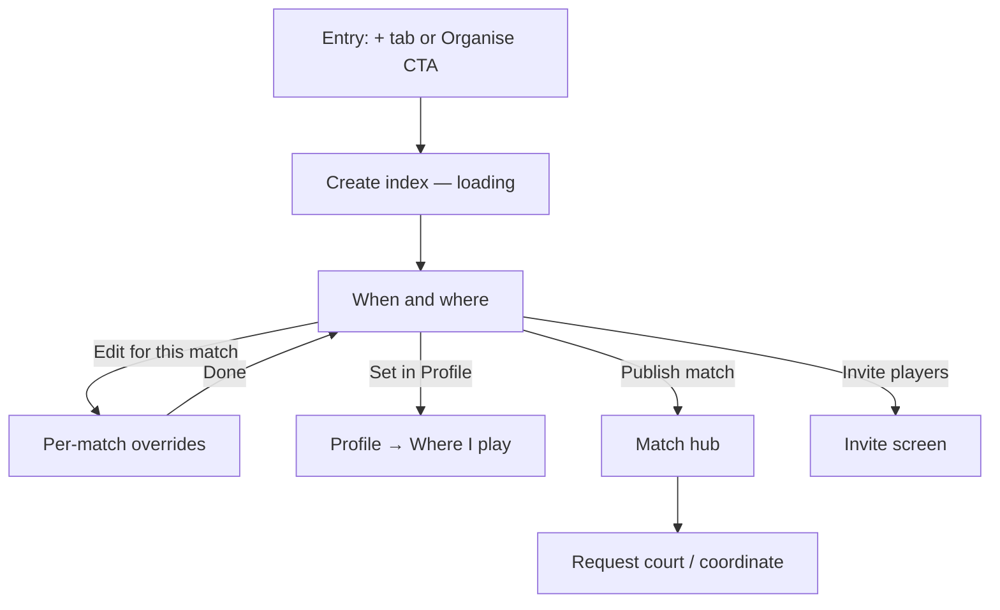
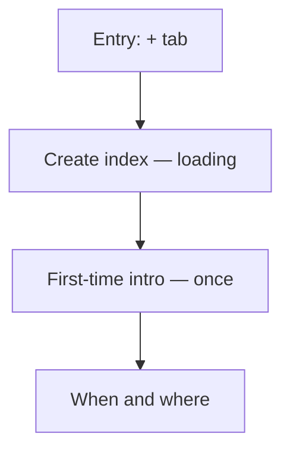
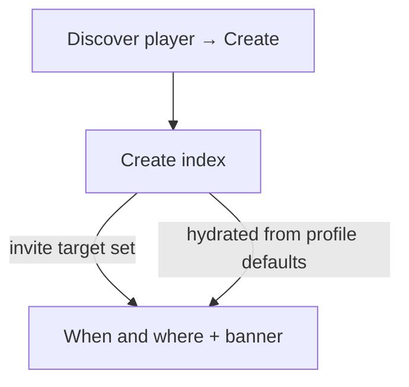

# Figma brief — Create match flow (mobile)

Design companion for uplifting the **organise a match** experience. Reflects the app as implemented in code (Aug 2026). Use with `docs/FLOWS_AND_SCREENS.md` and `docs/PRD.md` for product rules.

**FigJam stickies board:** [`docs/figjam/README.md`](figjam/README.md) — CSV + copy-paste stickies for a one-page flow map.

---

## Product goal (one screen to internalise)

> **Compatible player → agreed time → accepted court booking → played match**

Create match is not a long wizard. Profile holds **usual** settings; create is mostly **when, where, and publish**.

| Stored in profile (defaults) | Chosen at create (this flow)       |
| ---------------------------- | ---------------------------------- |
| Format, intent, level range  | Per-match overrides (optional)     |
| Areas, favourite clubs       | Time, club shortlist tweak         |
| Discover + approval defaults | Discover toggle on schedule screen |

---

## Entry points (design every path into the flow)

| Entry                                         | User intent         | Pre-filled draft                                  |
| --------------------------------------------- | ------------------- | ------------------------------------------------- |
| Tab bar **+** (centre)                        | Generic new match   | Cleared; profile defaults hydrate                 |
| Discover → player card **Create match**       | Challenge a player  | Target player, zones, overlap time, format/intent |
| Discover / Matches empty **Organise a match** | Create liquidity    | Cleared                                           |
| Player profile **Challenge to match**         | Same as player card | Same as player card                               |

**Guard:** If host already has an active open match (same format), show blocking alert with **Continue inviting** or **Cancel match** — do not allow a second publish.

---

## Flow map — returning host (happy path)

---

## Recommended Figma file structure

**Page:** `Create match — flows`

| Frame name                       | Route                    | Purpose                            |
| -------------------------------- | ------------------------ | ---------------------------------- |
| `CM / Entry / Tab + button`      | —                        | Annotate tab bar + entry points    |
| `CM / 00 / Loading`              | `/match/create`          | Spinner while profile + zones load |
| `CM / 00 / Load error`           | `/match/create`          | Error + Retry                      |
| `CM / 02 / When & where`         | `/match/create/schedule` | **Primary design surface**         |
| `CM / 02b / Overrides`           | `/match/create/details`  | Format, intent, level only         |
| `CM / 03 / Active match block`   | schedule                 | Status banner variant              |
| `CM / 04 / Invite target banner` | schedule                 | “Setting up match for {name}”      |
| `CM / Post / Match hub`          | `/match/[id]`            | After Publish                      |
| `CM / Post / Invite players`     | `/match/[id]/invite`     | After Invite players               |

**Page:** `Create match — components`

Reuse and spec: summary cards, panels, toggles, slot picker, club picker, footers.

**Page:** `Profile — feeds create`

| Frame                      | Route                     |
| -------------------------- | ------------------------- |
| `Profile / Where I play`   | `/profile/where-i-play`   |
| `Profile / Match defaults` | `/profile/match-defaults` |

---

## Screen specs

### CM / 00 — Loading (`index`)

- Full-screen centred spinner + “Loading…”
- No header; replaces into next screen
- **Error:** message + Retry (profile/zones fetch failed)

**Routing logic (for annotations):**

- Invite-for-player draft → skip straight to schedule
- Else → hydrate draft from profile → schedule

---

### CM / 01 — First-run “Where I play” (`/profile/where-i-play?firstRun=1`) — **once**

Reached from the onboarding completion CTA, not from create. It is what makes
areas and clubs pre-fill later, so it belongs to this flow even though it sits
on a profile route. It cannot be an onboarding step: the club RPCs reject
callers whose `onboarding_completed_at` is null.

**Title:** Where do you play?  
**Body:** Areas plus favourite clubs; both pre-fill every hosted match.

| Block  | Content                                         |
| ------ | ----------------------------------------------- |
| Areas  | Zone chips, saved on toggle                     |
| Clubs  | Favourite toggles for clubs in the chosen areas |
| Footer | Primary **Done**, secondary **Skip for now**    |

A host who skips picks clubs by hand on their first create; those clubs are then
saved as favourites so the second create is pre-filled.

---

### CM / 02 — When and where (`schedule`) — **hero screen**

**Title:** When and where  
**Back:** Returns to previous tab/screen  
**Layout:** `CreateMatchStepLayout` — scroll body + sticky footer

#### A. Match defaults summary (tappable card)

Opens overrides screen.

| Element                      | Spec                                                                     |
| ---------------------------- | ------------------------------------------------------------------------ |
| Header                       | “Match defaults for this listing” + chevron                              |
| **Three side-by-side cards** | Format · Play intent · Level range                                       |
| Each card                    | Icon, small label, value; equal width; bordered tile on `secondary` fill |
| Link                         | “Edit for this match” (primary text colour)                              |

**Uplift ideas:** stronger card hierarchy, skill band colour dot, haptic on tap, skeleton while profile loads.

#### B. When panel

| Element            | Spec                                                             |
| ------------------ | ---------------------------------------------------------------- |
| Slot picker        | Day, time, duration; Beirut-local                                |
| Link               | “More options” expands timing mode                               |
| Expanded           | Fixed vs flexible; add up to 3 slots (flexible)                  |
| Availability hints | Optional density from `suggest_match_times` (not always visible) |

#### C. Where panel

| State                    | UI                                              |
| ------------------------ | ----------------------------------------------- |
| Default (has favourites) | Area summary · club names summary · hints       |
| Collapsed                | “Change clubs for this match” / “Change areas”  |
| Expanded                 | Club checklist (max 3) · area chip multi-select |
| Link                     | “Set in Profile → Where I play”                 |
| Empty areas              | “Choose an area first to see clubs”             |
| Public + no clubs        | Publish blocked; alert on CTA                   |

#### D. Who can join panel

| Control               | Behaviour                                |
| --------------------- | ---------------------------------------- |
| List on Discover      | Toggle; drives `public` vs `invite_only` |
| Approve join requests | Shown only when Discover on              |

#### E. Notes

- Optional multiline field

#### F. Footer (sticky)

| Button                       | Action                                                              |
| ---------------------------- | ------------------------------------------------------------------- |
| Primary **Publish match**    | Create + publish → **Match hub**; auto-invite if player-target flow |
| Secondary **Invite players** | Create draft → **Invite screen** (no publish)                       |

**Inline error** above footer on validation failure.

#### Variants to frame

1. Default — clubs/areas collapsed, favourites shown
2. Clubs expanded — picker visible
3. Areas expanded — zone chips
4. Discover off — approval hidden; clubs optional
5. Active hosted match — banner replaces publish (continue existing match)
6. Invite-for-player — top status banner
7. Publishing — primary loading state
8. Validation error — zone required / club required / time in past

---

### CM / 02b — Per-match overrides (`details`)

**Title:** Overrides for this match (or similar)  
**Description:** One-off changes; profile defaults unchanged.

| Section     | Control                                            |
| ----------- | -------------------------------------------------- |
| Match type  | Singles / Doubles chips (multi)                    |
| Play intent | Social / Competitive / Either                      |
| Level       | `LevelRangePicker` multi-band; “Your level” marker |
| Footer      | **Done** → back to schedule (no save button)       |

Discover / clubs / areas **not** on this screen.

---

## Post-create destinations

| CTA                       | Next screen                 | Host goal                         |
| ------------------------- | --------------------------- | --------------------------------- |
| Publish match             | Match hub                   | Coordinate, vote time, book court |
| Invite players            | Invite flow                 | Pick players / share link         |
| (Player-target + Publish) | Hub + invite sent to target | Challenge flow                    |

---

## Profile screens that feed create (frame for context)

### Where I play (`/profile/where-i-play`)

- **Areas** — chip multi-select, auto-save
- **Favourite clubs** — toggle list filtered by areas
- **Browse all clubs** link
- Shown on Discover cards + player About when set

### Match defaults (`/profile/match-defaults`)

- Play intent, formats, default format when both, level range
- Discover + approval toggles
- **Auto-save** on change (no save button); “Saving…” indicator
- Errors inline

---

## Design tokens (mobile — `tennis-tokens`)

| Token             | Value     | Usage                            |
| ----------------- | --------- | -------------------------------- |
| `primary`         | `#0C382E` | Primary buttons, links           |
| `primaryDark`     | `#0D1C14` | Headings                         |
| `background`      | `#FAF9F6` | Screen bg                        |
| `card`            | `#FFFFFF` | Cards, panels                    |
| `secondary`       | `#E3EDE6` | Summary default cards            |
| `muted`           | `#ECF0EE` | Tags, chips idle                 |
| `mutedForeground` | `#627068` | Secondary text                   |
| `border`          | `#E9EBE8` | Container stroke, borders        |
| `accent`          | `#C4521A` | Errors, location accent          |
| `lime`            | `#C8E63B` | Welcome CTAs (not create footer) |

**Radii:** sm 10 · md 12 · lg 14 · xl 16 · pill 20  
**Screen padding:** 20px horizontal (create screens)  
**Touch targets:** min 44px (buttons)

**Typography:** Outfit / DM Sans family via `tennisFontFamily` — heading 24px screen title, body 14–15px, labels 11–13px.

---

## Component patterns (align Figma components to code)

| Pattern                 | Code reference                               | Notes                                                  |
| ----------------------- | -------------------------------------------- | ------------------------------------------------------ |
| Step layout             | `CreateMatchStepLayout`                      | Back, title, optional description, scroll, footer slot |
| Panel                   | `CreateMatchPanel`                           | Section title + content                                |
| Primary / secondary CTA | `FigmaPrimaryButton`, `FigmaSecondaryButton` | Full-width footer stack                                |
| Chips single            | `FigmaChipRow`, `ChipButton`                 | Format, intent                                         |
| Chips multi             | `FigmaChipMulti`                             | Areas, level bands                                     |
| Toggle card             | `SettingToggle` variant `card`               | Discover, approval                                     |
| Status banner           | `StatusBanner`                               | Invite target, active match                            |
| Summary default cards   | `CreateMatchSummaryBar`                      | 3-column card row                                      |
| Club row                | `PreferredClubPicker`                        | Checkbox rows, favourite badge                         |
| Slot picker             | `SlotPicker`                                 | Day scroll + time + duration                           |

---

## States matrix (must design)

| Screen    | Loading              | Empty            | Error                             | Success         |
| --------- | -------------------- | ---------------- | --------------------------------- | --------------- |
| Index     | Spinner              | —                | Load profile error + Retry        | Navigate away   |
| Schedule  | Zones/clubs fetching | No clubs in area | Publish error inline              | → Hub / Invite  |
| Overrides | Skill band loading   | —                | Format error (no format selected) | Done → schedule |

**Offline:** Schedule publish shows generic publish error; retry on hub.

**RTL:** Arabic — mirror row direction, chevrons, chip flow; test summary card row.

---

## Copy map (English keys — for Figma text layers)

| UI                | i18n key                                          |
| ----------------- | ------------------------------------------------- |
| Screen title      | `matches.create.scheduleTitle` → “When and where” |
| Summary header    | `matches.create.summaryBar.title`                 |
| Edit link         | `matches.create.summaryBar.edit`                  |
| Publish           | `matches.create.publish`                          |
| Invite            | `matches.invite.invitePlayers`                    |
| List on Discover  | `matches.create.listOnDiscover`                   |
| Approve requests  | `matches.create.requiresApprovalShort`            |
| Where I play link | `profile.whereIPlay.editLink`                     |

Full strings: `packages/i18n/src/locales/en.json`.

---

## UX uplift opportunities (design backlog)

Prioritised for Figma exploration — **not** all implemented.

1. **Progressive disclosure** — When panel default; where collapsed to one line (“Hamra · 2 clubs”); join settings visually lighter than time.
2. **Summary cards** — Skill band colour on level card; tap single card to jump to that override section.
3. **Time confidence** — Show “3 players free at this time” from suggestions API near slot picker.
4. **Club cards** — Logo/photo thumbnails in picker; map link for unfamiliar clubs.
5. **Publish clarity** — Primary = “Publish & find players”; secondary = “Save draft & invite” with one-line difference.
6. **Success moment** — Brief confirmation before hub (optional); share sheet for WhatsApp.
7. **Empty favourites** — Inline CTA to Where I play instead of empty club list.
8. **Accessibility** — Summary card row as individual accessibility elements; toggle labels not only visual.

---

## Validation rules (annotate in Figma)

| Rule                           | User feedback                             |
| ------------------------------ | ----------------------------------------- |
| ≥1 area                        | Alert: zone required                      |
| Public match + 0 clubs         | Alert: club required                      |
| Proposed time in past          | Inline publish error                      |
| 0 formats selected (overrides) | Format error on overrides                 |
| Active hosted match exists     | Block publish; alert with continue/cancel |
| Max 3 preferred clubs          | Picker disables further selection         |

---

## Out of scope for this flow

- In-app payments
- Review/preview step (removed; schedule is final before publish)
- A first-create sheet (removed; hosting defaults live in Profile → Match defaults)
- Club booking UI (match hub, separate flow)

---

## Handoff checklist for engineers

- [ ] Frame names match routes above
- [ ] All footer states: default, loading, disabled (active match)
- [ ] Light + dark not required v1 (light only today)
- [ ] Arabic frame for schedule + summary cards
- [ ] Component variants: toggle on/off, chip selected, banner types
- [ ] Annotations for auto-save vs explicit CTAs (profile vs create)

---

_Generated from mobile routes under_ `apps/mobile/app/match/create/` _and profile settings. Update this doc when flow changes materially; record decisions in_ `docs/DECISIONS.md`_._
